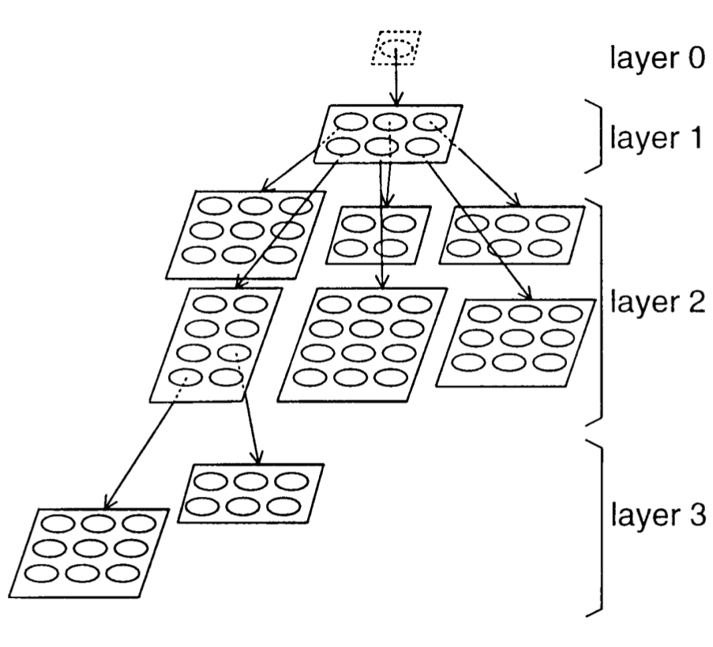
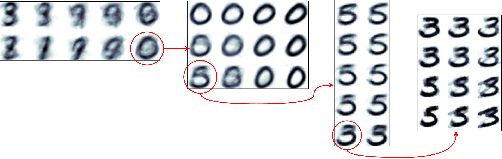
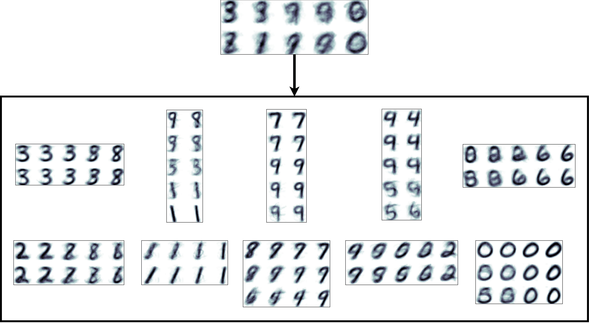

# The Growing Hierarchical Self-Organizing Map (GHSOM)
This implementation is based on the paper [The Growing Hierarchical Self-Organizing Map: Exploratory Analysis of High-Dimensional Data](https://ieeexplore.ieee.org/document/1058070/)

## Introduction
One of the most used method in cluster analysis is the SOM algorithm that allows to visualize high dimensional data into a two-dimensional space. What makes this more advisable than other methods is that the 2D output space tries to retain the topology of the original input space. 
On the other hand SOM shows some limitations:
* The fixed size constraints how the data is being mapped; therefore, without prior knowledge, it can be difficult to determine the network architecture providing the most satisfying results.
* Hierarchical relationships are not easily recognizable, since all the data is mapped in the same two-dimensional space.

In order to overcome these two major issues, a derived method has been proposed, the **Growing Hierarchical SOM**: `Growing SOM (SOM-like structure capable of expand his map) are spawned and used as vertices of a dynamic tree in order to allow both vertical and horizontal growing of the GHSOM.`

| An example of the GHSOM structure                                                                 |
|:-------------------------------------------------------------------------------------------------:|
|  |

### GHSOM training steps
The training phase of GHSOM is made by two steps:
* The initialization step in which the zero unit and its child map are created
* The tree training.

This last sptep can be further expanded into:
* GSOM map training
* GSOM growing
* Generation of GSOM childs

This three sub-steps are repeated until a stop criterion is satisfied.

_**A detailed explanation of the training process can be found on the reference paper. Furthermore, it is important to highlight that our implementation is not 100% equal to the paper theory**_

## Run the script
It is possible to run a demo of our implementation simply writing **`python3 test.py`** in your terminal

### Requirements
| Software  | Version | Necessary |
|:--------------------------------------------------------------:|:-------:|:--------------------------------:|
| [Python](https://www.python.org/downloads/)                    | 3.6.5   | Yes                              |
| [NumPy](http://www.numpy.org/)                                 | 1.14.2  | Yes                              |
| [ProgressBar 2](https://pypi.org/project/progressbar2/)        | 3.37.1  | Yes                              |
| [matplotlib](https://matplotlib.org/)                          | 2.2.2   | No (used in test.py for plotting)|                 
| [scikit-learn](http://scikit-learn.org/stable/)                | 0.19.1  | No (used in test.py for dataset) |

### Some results
| Example branch showing how GHSOM increases details as depth grows |                                                          
|:-------------------------------------------------------------------------------------------------:|
|  |

| The layers 1 & 2 of the GHSOM. The maps on the latter are disposed according to the position of their parent unit |                                                          
|:-------------------------------------------------------------------------------------------------:|
|  |
